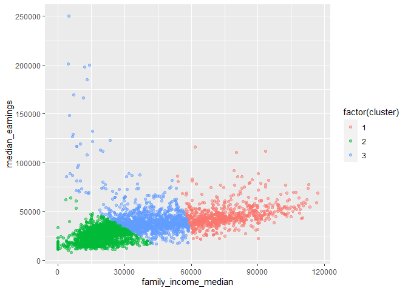

Clustering
================

-   [Load and explore data structure](#load-and-explore-data-structure)
-   [Variable Selection and Data
    Preparation](#variable-selection-and-data-preparation)
-   [Selecting collection of schools to target for
    grants](#selecting-collection-of-schools-to-target-for-grants)
-   [Conclusion](#conclusion)

Suppose a granting agency wants to identify colleges that have high
numbers of low-income and first generation colleges attendees to give
additional funding.

Using clustering methods, I will identify a collection of colleges that
meet these criteria.

``` r
# Load libraries
library(tidyverse)
library(ggdendro)
library(plotly)
```

# Load and explore data structure

``` r
setwd("C:/Users/danie/OneDrive/Desktop/Data")

colleges <- read.delim('colleges.tsv', 
                       header = TRUE, 
                       sep = '\t')
colleges[1:50,]
```

    ##        id                                    institution_name              city
    ## 1  100654                            Alabama A & M University            Normal
    ## 2  100663                 University of Alabama at Birmingham        Birmingham
    ## 3  100690                                  Amridge University        Montgomery
    ## 4  100706                 University of Alabama in Huntsville        Huntsville
    ## 5  100724                            Alabama State University        Montgomery
    ## 6  100751                           The University of Alabama        Tuscaloosa
    ## 7  100760                   Central Alabama Community College    Alexander City
    ## 8  100812                             Athens State University            Athens
    ## 9  100830                     Auburn University at Montgomery        Montgomery
    ## 10 100858                                   Auburn University Auburn University
    ## 11 100937                         Birmingham Southern College        Birmingham
    ## 12 101028              Chattahoochee Valley Community College       Phenix City
    ## 13 101073                           Concordia College Alabama             Selma
    ## 14 101116                         South University-Montgomery        Montgomery
    ## 15 101143                  Enterprise State Community College        Enterprise
    ## 16 101161            James H Faulkner State Community College       Bay Minette
    ## 17 101189                                 Faulkner University        Montgomery
    ## 18 101240                     Gadsden State Community College           Gadsden
    ## 19 101277                New Beginning College of Cosmetology       Albertville
    ## 20 101286     George C Wallace State Community College-Dothan            Dothan
    ## 21 101295 George C Wallace State Community College-Hanceville        Hanceville
    ## 22 101301      George C Wallace State Community College-Selma             Selma
    ## 23 101365                       Herzing University-Birmingham        Birmingham
    ## 24 101435                                  Huntingdon College        Montgomery
    ## 25 101453                       Heritage Christian University          Florence
    ## 26 101462     J F Drake State Community and Technical College        Huntsville
    ## 27 101480                       Jacksonville State University      Jacksonville
    ## 28 101499                   Jefferson Davis Community College           Brewton
    ## 29 101505                   Jefferson State Community College        Birmingham
    ## 30 101514              John C Calhoun State Community College            Tanner
    ## 31 101541                                      Judson College            Marion
    ## 32 101569    Lawson State Community College-Birmingham Campus        Birmingham
    ## 33 101587                          University of West Alabama        Livingston
    ## 34 101602                 Lurleen B Wallace Community College         Andalusia
    ## 35 101648                           Marion Military Institute            Marion
    ## 36 101675                                       Miles College         Fairfield
    ## 37 101693                                University of Mobile            Mobile
    ## 38 101709                            University of Montevallo        Montevallo
    ## 39 101736                  Northwest-Shoals Community College     Muscle Shoals
    ## 40 101879                         University of North Alabama          Florence
    ## 41 101897                 Northeast Alabama Community College        Rainsville
    ## 42 101912                                  Oakwood University        Huntsville
    ## 43 101949                  Alabama Southern Community College       Monroeville
    ## 44 101958                          Prince Institute-Southeast        Montgomery
    ## 45 101994                        Reid State Technical College         Evergreen
    ## 46 102030                      Bishop State Community College            Mobile
    ## 47 102049                                  Samford University        Birmingham
    ## 48 102058                                    Selma University             Selma
    ## 49 102067                     Shelton State Community College        Tuscaloosa
    ## 50 102076                       Snead State Community College              Boaz
    ##    state         locale            control
    ## 1     AL  City: Midsize             Public
    ## 2     AL  City: Midsize             Public
    ## 3     AL  City: Midsize  Private nonprofit
    ## 4     AL  City: Midsize             Public
    ## 5     AL  City: Midsize             Public
    ## 6     AL    City: Small             Public
    ## 7     AL  Town: Distant             Public
    ## 8     AL   Town: Fringe             Public
    ## 9     AL  City: Midsize             Public
    ## 10    AL    City: Small             Public
    ## 11    AL  City: Midsize  Private nonprofit
    ## 12    AL  Rural: Fringe             Public
    ## 13    AL  Town: Distant  Private nonprofit
    ## 14    AL  City: Midsize Private for-profit
    ## 15    AL  Town: Distant             Public
    ## 16    AL  Town: Distant             Public
    ## 17    AL  City: Midsize  Private nonprofit
    ## 18    AL    City: Small             Public
    ## 19    AL  Town: Distant Private for-profit
    ## 20    AL  Rural: Fringe             Public
    ## 21    AL  Town: Distant             Public
    ## 22    AL  Town: Distant             Public
    ## 23    AL  Suburb: Large Private for-profit
    ## 24    AL  City: Midsize  Private nonprofit
    ## 25    AL    City: Small  Private nonprofit
    ## 26    AL  City: Midsize             Public
    ## 27    AL    City: Small             Public
    ## 28    AL  Town: Distant             Public
    ## 29    AL  City: Midsize             Public
    ## 30    AL  Rural: Fringe             Public
    ## 31    AL  Rural: Remote  Private nonprofit
    ## 32    AL  City: Midsize             Public
    ## 33    AL  Rural: Remote             Public
    ## 34    AL  Rural: Fringe             Public
    ## 35    AL  Rural: Remote             Public
    ## 36    AL  Suburb: Large  Private nonprofit
    ## 37    AL  Rural: Fringe  Private nonprofit
    ## 38    AL  Suburb: Large             Public
    ## 39    AL    City: Small             Public
    ## 40    AL    City: Small             Public
    ## 41    AL Rural: Distant             Public
    ## 42    AL  City: Midsize  Private nonprofit
    ## 43    AL  Rural: Fringe             Public
    ## 44    AL  City: Midsize Private for-profit
    ## 45    AL  Rural: Fringe             Public
    ## 46    AL  City: Midsize             Public
    ## 47    AL  Suburb: Large  Private nonprofit
    ## 48    AL  Town: Distant  Private nonprofit
    ## 49    AL    City: Small             Public
    ## 50    AL  Town: Distant             Public
    ##                                     pred_deg     highest_degree
    ## 1   Predominantly bachelor's-degree granting    Graduate degree
    ## 2   Predominantly bachelor's-degree granting    Graduate degree
    ## 3   Predominantly bachelor's-degree granting    Graduate degree
    ## 4   Predominantly bachelor's-degree granting    Graduate degree
    ## 5   Predominantly bachelor's-degree granting    Graduate degree
    ## 6   Predominantly bachelor's-degree granting    Graduate degree
    ## 7  Predominantly associate's-degree granting   Associate degree
    ## 8   Predominantly bachelor's-degree granting  Bachelor's degree
    ## 9   Predominantly bachelor's-degree granting    Graduate degree
    ## 10  Predominantly bachelor's-degree granting    Graduate degree
    ## 11  Predominantly bachelor's-degree granting  Bachelor's degree
    ## 12 Predominantly associate's-degree granting   Associate degree
    ## 13  Predominantly bachelor's-degree granting  Bachelor's degree
    ## 14 Predominantly associate's-degree granting    Graduate degree
    ## 15 Predominantly associate's-degree granting   Associate degree
    ## 16 Predominantly associate's-degree granting   Associate degree
    ## 17  Predominantly bachelor's-degree granting    Graduate degree
    ## 18 Predominantly associate's-degree granting   Associate degree
    ## 19 Predominantly certificate-degree granting Certificate degree
    ## 20 Predominantly associate's-degree granting   Associate degree
    ## 21 Predominantly associate's-degree granting   Associate degree
    ## 22 Predominantly associate's-degree granting   Associate degree
    ## 23 Predominantly certificate-degree granting  Bachelor's degree
    ## 24  Predominantly bachelor's-degree granting  Bachelor's degree
    ## 25  Predominantly bachelor's-degree granting    Graduate degree
    ## 26 Predominantly certificate-degree granting   Associate degree
    ## 27  Predominantly bachelor's-degree granting    Graduate degree
    ## 28 Predominantly associate's-degree granting   Associate degree
    ## 29 Predominantly associate's-degree granting   Associate degree
    ## 30 Predominantly associate's-degree granting   Associate degree
    ## 31  Predominantly bachelor's-degree granting  Bachelor's degree
    ## 32 Predominantly certificate-degree granting   Associate degree
    ## 33  Predominantly bachelor's-degree granting    Graduate degree
    ## 34 Predominantly certificate-degree granting   Associate degree
    ## 35 Predominantly associate's-degree granting   Associate degree
    ## 36  Predominantly bachelor's-degree granting  Bachelor's degree
    ## 37  Predominantly bachelor's-degree granting    Graduate degree
    ## 38  Predominantly bachelor's-degree granting    Graduate degree
    ## 39 Predominantly associate's-degree granting   Associate degree
    ## 40  Predominantly bachelor's-degree granting    Graduate degree
    ## 41 Predominantly associate's-degree granting   Associate degree
    ## 42  Predominantly bachelor's-degree granting    Graduate degree
    ## 43 Predominantly associate's-degree granting   Associate degree
    ## 44 Predominantly associate's-degree granting   Associate degree
    ## 45 Predominantly certificate-degree granting   Associate degree
    ## 46 Predominantly associate's-degree granting   Associate degree
    ## 47  Predominantly bachelor's-degree granting    Graduate degree
    ## 48  Predominantly bachelor's-degree granting    Graduate degree
    ## 49 Predominantly associate's-degree granting   Associate degree
    ## 50 Predominantly associate's-degree granting   Associate degree
    ##    historically_black men_only women_only religious sat_verbal_quartile_1
    ## 1                TRUE    FALSE      FALSE     FALSE                   370
    ## 2               FALSE    FALSE      FALSE     FALSE                   520
    ## 3               FALSE    FALSE      FALSE      TRUE                    NA
    ## 4               FALSE    FALSE      FALSE     FALSE                   510
    ## 5                TRUE    FALSE      FALSE     FALSE                   380
    ## 6               FALSE    FALSE      FALSE     FALSE                   490
    ## 7               FALSE    FALSE      FALSE     FALSE                    NA
    ## 8               FALSE    FALSE      FALSE     FALSE                    NA
    ## 9               FALSE    FALSE      FALSE     FALSE                    NA
    ## 10              FALSE    FALSE      FALSE     FALSE                   520
    ## 11              FALSE    FALSE      FALSE      TRUE                   520
    ## 12              FALSE    FALSE      FALSE     FALSE                    NA
    ## 13               TRUE    FALSE      FALSE      TRUE                    NA
    ## 14              FALSE    FALSE      FALSE     FALSE                    NA
    ## 15              FALSE    FALSE      FALSE     FALSE                    NA
    ## 16              FALSE    FALSE      FALSE     FALSE                    NA
    ## 17              FALSE    FALSE      FALSE      TRUE                    NA
    ## 18               TRUE    FALSE      FALSE     FALSE                    NA
    ## 19              FALSE    FALSE      FALSE     FALSE                    NA
    ## 20              FALSE    FALSE      FALSE     FALSE                    NA
    ## 21              FALSE    FALSE      FALSE     FALSE                    NA
    ## 22              FALSE    FALSE      FALSE     FALSE                    NA
    ## 23              FALSE    FALSE      FALSE     FALSE                    NA
    ## 24              FALSE    FALSE      FALSE      TRUE                   420
    ## 25              FALSE    FALSE      FALSE      TRUE                    NA
    ## 26               TRUE    FALSE      FALSE     FALSE                    NA
    ## 27              FALSE    FALSE      FALSE     FALSE                   430
    ## 28              FALSE    FALSE      FALSE     FALSE                    NA
    ## 29              FALSE    FALSE      FALSE     FALSE                    NA
    ## 30              FALSE    FALSE      FALSE     FALSE                    NA
    ## 31              FALSE    FALSE       TRUE      TRUE                   550
    ## 32               TRUE    FALSE      FALSE     FALSE                    NA
    ## 33              FALSE    FALSE      FALSE     FALSE                    NA
    ## 34              FALSE    FALSE      FALSE     FALSE                    NA
    ## 35              FALSE    FALSE      FALSE     FALSE                   460
    ## 36               TRUE    FALSE      FALSE      TRUE                    NA
    ## 37              FALSE    FALSE      FALSE      TRUE                   470
    ## 38              FALSE    FALSE      FALSE     FALSE                   495
    ## 39              FALSE    FALSE      FALSE     FALSE                    NA
    ## 40              FALSE    FALSE      FALSE     FALSE                   413
    ## 41              FALSE    FALSE      FALSE     FALSE                    NA
    ## 42               TRUE    FALSE      FALSE      TRUE                   410
    ## 43              FALSE    FALSE      FALSE     FALSE                    NA
    ## 44              FALSE    FALSE      FALSE     FALSE                    NA
    ## 45              FALSE    FALSE      FALSE     FALSE                    NA
    ## 46               TRUE    FALSE      FALSE     FALSE                    NA
    ## 47              FALSE    FALSE      FALSE      TRUE                   500
    ## 48               TRUE    FALSE      FALSE      TRUE                    NA
    ## 49               TRUE    FALSE      FALSE     FALSE                    NA
    ## 50              FALSE    FALSE      FALSE     FALSE                    NA
    ##    sat_verbal_quartile_2 sat_verbal_quartile_3 sat_math_quartile_1
    ## 1                    410                   450                 350
    ## 2                    580                   640                 520
    ## 3                     NA                    NA                  NA
    ## 4                    575                   640                 510
    ## 5                    430                   480                 370
    ## 6                    555                   620                 500
    ## 7                     NA                    NA                  NA
    ## 8                     NA                    NA                  NA
    ## 9                     NA                    NA                  NA
    ## 10                   570                   620                 540
    ## 11                   575                   630                 520
    ## 12                    NA                    NA                  NA
    ## 13                    NA                    NA                  NA
    ## 14                    NA                    NA                  NA
    ## 15                    NA                    NA                  NA
    ## 16                    NA                    NA                  NA
    ## 17                    NA                    NA                  NA
    ## 18                    NA                    NA                  NA
    ## 19                    NA                    NA                  NA
    ## 20                    NA                    NA                  NA
    ## 21                    NA                    NA                  NA
    ## 22                    NA                    NA                  NA
    ## 23                    NA                    NA                  NA
    ## 24                   460                   500                 420
    ## 25                    NA                    NA                  NA
    ## 26                    NA                    NA                  NA
    ## 27                   485                   540                 420
    ## 28                    NA                    NA                  NA
    ## 29                    NA                    NA                  NA
    ## 30                    NA                    NA                  NA
    ## 31                   595                   640                 500
    ## 32                    NA                    NA                  NA
    ## 33                    NA                    NA                  NA
    ## 34                    NA                    NA                  NA
    ## 35                   525                   590                 460
    ## 36                    NA                    NA                  NA
    ## 37                   540                   610                 470
    ## 38                   554                   613                 465
    ## 39                    NA                    NA                  NA
    ## 40                   489                   565                 433
    ## 41                    NA                    NA                  NA
    ## 42                   462                   513                 400
    ## 43                    NA                    NA                  NA
    ## 44                    NA                    NA                  NA
    ## 45                    NA                    NA                  NA
    ## 46                    NA                    NA                  NA
    ## 47                   565                   630                 510
    ## 48                    NA                    NA                  NA
    ## 49                    NA                    NA                  NA
    ## 50                    NA                    NA                  NA
    ##    sat_math_quartile_2 sat_math_quartile_3 sat_writing_quartile_1
    ## 1                  400                 450                     NA
    ## 2                  585                 650                     NA
    ## 3                   NA                  NA                     NA
    ## 4                  580                 650                     NA
    ## 5                  425                 480                     NA
    ## 6                  570                 640                    480
    ## 7                   NA                  NA                     NA
    ## 8                   NA                  NA                     NA
    ## 9                   NA                  NA                     NA
    ## 10                 595                 650                    510
    ## 11                 580                 640                     NA
    ## 12                  NA                  NA                     NA
    ## 13                  NA                  NA                     NA
    ## 14                  NA                  NA                     NA
    ## 15                  NA                  NA                     NA
    ## 16                  NA                  NA                     NA
    ## 17                  NA                  NA                     NA
    ## 18                  NA                  NA                     NA
    ## 19                  NA                  NA                     NA
    ## 20                  NA                  NA                     NA
    ## 21                  NA                  NA                     NA
    ## 22                  NA                  NA                     NA
    ## 23                  NA                  NA                     NA
    ## 24                 480                 540                     NA
    ## 25                  NA                  NA                     NA
    ## 26                  NA                  NA                     NA
    ## 27                 480                 540                     NA
    ## 28                  NA                  NA                     NA
    ## 29                  NA                  NA                     NA
    ## 30                  NA                  NA                     NA
    ## 31                 550                 600                    530
    ## 32                  NA                  NA                     NA
    ## 33                  NA                  NA                     NA
    ## 34                  NA                  NA                     NA
    ## 35                 530                 600                     NA
    ## 36                  NA                  NA                     NA
    ## 37                 575                 680                     NA
    ## 38                 508                 550                    440
    ## 39                  NA                  NA                     NA
    ## 40                 482                 530                     NA
    ## 41                  NA                  NA                     NA
    ## 42                 455                 510                     NA
    ## 43                  NA                  NA                     NA
    ## 44                  NA                  NA                     NA
    ## 45                  NA                  NA                     NA
    ## 46                  NA                  NA                     NA
    ## 47                 560                 610                    500
    ## 48                  NA                  NA                     NA
    ## 49                  NA                  NA                     NA
    ## 50                  NA                  NA                     NA
    ##    sat_writing_quartile_2 sat_writing_quartile_3 agriculture_major_perc
    ## 1                      NA                     NA                 0.0397
    ## 2                      NA                     NA                 0.0000
    ## 3                      NA                     NA                 0.0000
    ## 4                      NA                     NA                 0.0000
    ## 5                      NA                     NA                 0.0000
    ## 6                     540                    600                 0.0000
    ## 7                      NA                     NA                 0.0000
    ## 8                      NA                     NA                 0.0000
    ## 9                      NA                     NA                 0.0000
    ## 10                    565                    620                 0.0444
    ## 11                     NA                     NA                 0.0000
    ## 12                     NA                     NA                 0.0000
    ## 13                     NA                     NA                 0.0000
    ## 14                     NA                     NA                 0.0000
    ## 15                     NA                     NA                 0.0000
    ## 16                     NA                     NA                 0.0085
    ## 17                     NA                     NA                 0.0000
    ## 18                     NA                     NA                 0.0069
    ## 19                     NA                     NA                 0.0000
    ## 20                     NA                     NA                 0.0000
    ## 21                     NA                     NA                 0.0011
    ## 22                     NA                     NA                 0.0000
    ## 23                     NA                     NA                 0.0000
    ## 24                     NA                     NA                 0.0000
    ## 25                     NA                     NA                 0.0000
    ## 26                     NA                     NA                 0.0000
    ## 27                     NA                     NA                 0.0000
    ## 28                     NA                     NA                 0.0000
    ## 29                     NA                     NA                 0.0067
    ## 30                     NA                     NA                 0.0186
    ## 31                    570                    610                 0.0345
    ## 32                     NA                     NA                 0.0000
    ## 33                     NA                     NA                 0.0000
    ## 34                     NA                     NA                 0.0000
    ## 35                     NA                     NA                 0.0000
    ## 36                     NA                     NA                 0.0000
    ## 37                     NA                     NA                 0.0000
    ## 38                    510                    580                 0.0000
    ## 39                     NA                     NA                 0.0000
    ## 40                     NA                     NA                 0.0000
    ## 41                     NA                     NA                 0.0000
    ## 42                     NA                     NA                 0.0000
    ## 43                     NA                     NA                 0.0000
    ## 44                     NA                     NA                 0.0000
    ## 45                     NA                     NA                 0.0000
    ## 46                     NA                     NA                 0.0000
    ## 47                    555                    610                 0.0000
    ## 48                     NA                     NA                 0.0000
    ## 49                     NA                     NA                 0.0000
    ## 50                     NA                     NA                 0.0000
    ##    resources_major_perc architecture_major_perc cultural_major_perc
    ## 1                0.0199                  0.0116              0.0000
    ## 2                0.0000                  0.0000              0.0018
    ## 3                0.0000                  0.0000              0.0000
    ## 4                0.0000                  0.0000              0.0000
    ## 5                0.0000                  0.0000              0.0000
    ## 6                0.0054                  0.0000              0.0022
    ## 7                0.0000                  0.0000              0.0000
    ## 8                0.0000                  0.0000              0.0000
    ## 9                0.0000                  0.0000              0.0000
    ## 10               0.0152                  0.0189              0.0000
    ## 11               0.0166                  0.0000              0.0000
    ## 12               0.0000                  0.0000              0.0000
    ## 13               0.0000                  0.0000              0.0000
    ## 14               0.0000                  0.0000              0.0000
    ## 15               0.0000                  0.0000              0.0000
    ## 16               0.0000                  0.0000              0.0000
    ## 17               0.0000                  0.0000              0.0000
    ## 18               0.0000                  0.0000              0.0000
    ## 19               0.0000                  0.0000              0.0000
    ## 20               0.0000                  0.0000              0.0000
    ## 21               0.0000                  0.0000              0.0000
    ## 22               0.0000                  0.0000              0.0000
    ## 23               0.0000                  0.0000              0.0000
    ## 24               0.0000                  0.0000              0.0000
    ## 25               0.0000                  0.0000              0.0000
    ## 26               0.0000                  0.0000              0.0000
    ## 27               0.0000                  0.0000              0.0000
    ## 28               0.0000                  0.0000              0.0000
    ## 29               0.0000                  0.0000              0.0000
    ## 30               0.0000                  0.0000              0.0000
    ## 31               0.0000                  0.0000              0.0000
    ## 32               0.0000                  0.0000              0.0000
    ## 33               0.0000                  0.0000              0.0000
    ## 34               0.0292                  0.0000              0.0000
    ## 35               0.0000                  0.0000              0.0000
    ## 36               0.0107                  0.0000              0.0000
    ## 37               0.0000                  0.0000              0.0000
    ## 38               0.0000                  0.0000              0.0000
    ## 39               0.0000                  0.0000              0.0000
    ## 40               0.0000                  0.0000              0.0000
    ## 41               0.0000                  0.0000              0.0000
    ## 42               0.0000                  0.0000              0.0000
    ## 43               0.0000                  0.0000              0.0000
    ## 44               0.0000                  0.0000              0.0000
    ## 45               0.0000                  0.0000              0.0000
    ## 46               0.0000                  0.0000              0.0000
    ## 47               0.0000                  0.0000              0.0044
    ## 48               0.0000                  0.0000              0.0000
    ## 49               0.0000                  0.0000              0.0000
    ## 50               0.0000                  0.0000              0.0000
    ##    communications_major_perc comm_tech_major_perc computer_science_major_perc
    ## 1                     0.0000               0.0348                      0.0348
    ## 2                     0.0456               0.0000                      0.0099
    ## 3                     0.0000               0.0000                      0.0411
    ## 4                     0.0318               0.0000                      0.0273
    ## 5                     0.0733               0.0000                      0.0450
    ## 6                     0.1084               0.0000                      0.0068
    ## 7                     0.0000               0.0000                      0.0186
    ## 8                     0.0000               0.0000                      0.0386
    ## 9                     0.0534               0.0000                      0.0000
    ## 10                    0.0584               0.0000                      0.0051
    ## 11                    0.0133               0.0000                      0.0033
    ## 12                    0.0000               0.0000                      0.0205
    ## 13                    0.0000               0.0000                      0.0000
    ## 14                    0.0000               0.0000                      0.0735
    ## 15                    0.0000               0.0000                      0.0085
    ## 16                    0.0000               0.0000                      0.0449
    ## 17                    0.0000               0.0000                      0.0140
    ## 18                    0.0057               0.0000                      0.0069
    ## 19                    0.0000               0.0000                      0.0000
    ## 20                    0.0000               0.0000                      0.0081
    ## 21                    0.0000               0.0000                      0.0130
    ## 22                    0.0000               0.0000                      0.0147
    ## 23                    0.0000               0.0000                      0.1304
    ## 24                    0.0461               0.0000                      0.0000
    ## 25                    0.0000               0.0000                      0.0000
    ## 26                    0.0000               0.0000                      0.1357
    ## 27                    0.0330               0.0000                      0.0132
    ## 28                    0.0000               0.0000                      0.0000
    ## 29                    0.0000               0.0045                      0.0632
    ## 30                    0.0000               0.0000                      0.0212
    ## 31                    0.0000               0.0000                      0.0000
    ## 32                    0.0000               0.0287                      0.0478
    ## 33                    0.0034               0.0000                      0.0000
    ## 34                    0.0000               0.0000                      0.0219
    ## 35                    0.0000               0.0000                      0.0000
    ## 36                    0.0963               0.0000                      0.0588
    ## 37                    0.0167               0.0000                      0.0067
    ## 38                    0.0521               0.0000                      0.0000
    ## 39                    0.0000               0.0000                      0.0053
    ## 40                    0.0725               0.0000                      0.0137
    ## 41                    0.0000               0.0000                      0.0214
    ## 42                    0.0222               0.0000                      0.0139
    ## 43                    0.0000               0.0000                      0.0000
    ## 44                    0.0000               0.0000                      0.0000
    ## 45                    0.0000               0.0000                      0.0741
    ## 46                    0.0000               0.0103                      0.0258
    ## 47                    0.0888               0.0000                      0.0074
    ## 48                    0.0000               0.0000                      0.0000
    ## 49                    0.0000               0.0000                      0.0000
    ## 50                    0.0000               0.0000                      0.0465
    ##    culinary_major_perc education_major_perc engineering_major_perc
    ## 1               0.0000               0.1490                 0.1175
    ## 2               0.0000               0.0862                 0.0632
    ## 3               0.0000               0.0000                 0.0000
    ## 4               0.0000               0.0173                 0.2566
    ## 5               0.0000               0.2150                 0.0000
    ## 6               0.0000               0.0840                 0.0640
    ## 7               0.0000               0.0000                 0.0000
    ## 8               0.0000               0.2404                 0.0000
    ## 9               0.0000               0.1406                 0.0000
    ## 10              0.0000               0.1066                 0.1491
    ## 11              0.0000               0.0731                 0.0033
    ## 12              0.0000               0.0000                 0.0000
    ## 13              0.0000               0.3457                 0.0000
    ## 14              0.0000               0.0000                 0.0000
    ## 15              0.0000               0.0000                 0.0000
    ## 16              0.0000               0.0000                 0.0000
    ## 17              0.0000               0.0315                 0.0000
    ## 18              0.0631               0.0000                 0.0000
    ## 19              1.0000               0.0000                 0.0000
    ## 20              0.0477               0.0000                 0.0000
    ## 21              0.0346               0.0000                 0.0000
    ## 22              0.0590               0.0000                 0.0000
    ## 23              0.0000               0.0000                 0.0000
    ## 24              0.0000               0.0553                 0.0000
    ## 25              0.0000               0.0000                 0.0000
    ## 26              0.1357               0.0000                 0.0000
    ## 27              0.0000               0.1311                 0.0000
    ## 28              0.0407               0.0000                 0.0000
    ## 29              0.0624               0.0000                 0.0000
    ## 30              0.0141               0.0000                 0.0000
    ## 31              0.0000               0.0690                 0.0000
    ## 32              0.0877               0.0000                 0.0000
    ## 33              0.0000               0.2169                 0.0000
    ## 34              0.0730               0.0000                 0.0000
    ## 35              0.0000               0.0000                 0.0000
    ## 36              0.0000               0.0802                 0.0000
    ## 37              0.0000               0.2007                 0.0000
    ## 38              0.0000               0.1104                 0.0000
    ## 39              0.0398               0.0000                 0.0000
    ## 40              0.0000               0.1208                 0.0000
    ## 41              0.0361               0.0000                 0.0000
    ## 42              0.0000               0.0500                 0.0000
    ## 43              0.0432               0.0000                 0.0000
    ## 44              0.0000               0.0000                 0.0000
    ## 45              0.0952               0.0000                 0.0000
    ## 46              0.0336               0.0000                 0.0000
    ## 47              0.0000               0.0784                 0.0000
    ## 48              0.0000               0.0000                 0.0000
    ## 49              0.0578               0.0000                 0.0000
    ## 50              0.0148               0.0000                 0.0000
    ##    eng_tech_major_perc language_major_perc consumer_science_major_perc
    ## 1               0.0348              0.0000                      0.0281
    ## 2               0.0000              0.0090                      0.0000
    ## 3               0.0000              0.0000                      0.0000
    ## 4               0.0000              0.0173                      0.0000
    ## 5               0.0000              0.0000                      0.0000
    ## 6               0.0000              0.0068                      0.0700
    ## 7               0.0669              0.0000                      0.0000
    ## 8               0.0000              0.0000                      0.0000
    ## 9               0.0000              0.0036                      0.0000
    ## 10              0.0000              0.0161                      0.0475
    ## 11              0.0000              0.0133                      0.0000
    ## 12              0.0000              0.0000                      0.0000
    ## 13              0.0000              0.0000                      0.0000
    ## 14              0.0000              0.0000                      0.0000
    ## 15              0.0000              0.0000                      0.0085
    ## 16              0.0043              0.0000                      0.0000
    ## 17              0.0000              0.0000                      0.0000
    ## 18              0.1239              0.0000                      0.0183
    ## 19              0.0000              0.0000                      0.0000
    ## 20              0.0862              0.0000                      0.0467
    ## 21              0.0281              0.0000                      0.0141
    ## 22              0.0221              0.0000                      0.0000
    ## 23              0.0163              0.0000                      0.0000
    ## 24              0.0000              0.0000                      0.0000
    ## 25              0.0000              0.0000                      0.0000
    ## 26              0.0643              0.0000                      0.0000
    ## 27              0.0234              0.0029                      0.0249
    ## 28              0.0854              0.0000                      0.0325
    ## 29              0.0535              0.0000                      0.0461
    ## 30              0.0990              0.0000                      0.0084
    ## 31              0.0000              0.0000                      0.0000
    ## 32              0.1164              0.0000                      0.1005
    ## 33              0.0237              0.0000                      0.0000
    ## 34              0.0268              0.0000                      0.0170
    ## 35              0.0000              0.0000                      0.0000
    ## 36              0.0000              0.0000                      0.0321
    ## 37              0.0000              0.0000                      0.0000
    ## 38              0.0000              0.0123                      0.0767
    ## 39              0.0438              0.0000                      0.0411
    ## 40              0.0000              0.0095                      0.0378
    ## 41              0.0643              0.0000                      0.0327
    ## 42              0.0000              0.0278                      0.0139
    ## 43              0.1528              0.0000                      0.0000
    ## 44              0.0000              0.0000                      0.0000
    ## 45              0.0000              0.0000                      0.0423
    ## 46              0.0801              0.0000                      0.0543
    ## 47              0.0000              0.0163                      0.0533
    ## 48              0.0000              0.0000                      0.0000
    ## 49              0.0478              0.0000                      0.0060
    ## 50              0.0127              0.0000                      0.0211
    ##    law_major_perc english_major_perc liberal_arts_major_perc
    ## 1          0.0000             0.0182                  0.0546
    ## 2          0.0000             0.0203                  0.0262
    ## 3          0.0000             0.0000                  0.6301
    ## 4          0.0000             0.0309                  0.0000
    ## 5          0.0000             0.0183                  0.0000
    ## 6          0.0000             0.0178                  0.0000
    ## 7          0.0000             0.0000                  0.4833
    ## 8          0.0000             0.0441                  0.0540
    ## 9          0.0000             0.0160                  0.0267
    ## 10         0.0000             0.0196                  0.0000
    ## 11         0.0000             0.0698                  0.0000
    ## 12         0.0000             0.0000                  0.3846
    ## 13         0.0000             0.0000                  0.4815
    ## 14         0.0662             0.0000                  0.0000
    ## 15         0.0021             0.0000                  0.1855
    ## 16         0.0128             0.0000                  0.4637
    ## 17         0.0140             0.0053                  0.0158
    ## 18         0.0298             0.0000                  0.1950
    ## 19         0.0000             0.0000                  0.0000
    ## 20         0.0000             0.0000                  0.2069
    ## 21         0.0119             0.0000                  0.2162
    ## 22         0.0000             0.0000                  0.3292
    ## 23         0.0000             0.0000                  0.0000
    ## 24         0.0000             0.0369                  0.0000
    ## 25         0.0000             0.0000                  0.0000
    ## 26         0.0000             0.0000                  0.0000
    ## 27         0.0000             0.0227                  0.0396
    ## 28         0.0000             0.0000                  0.3049
    ## 29         0.0000             0.0000                  0.2043
    ## 30         0.0000             0.0000                  0.3981
    ## 31         0.0000             0.0690                  0.0000
    ## 32         0.0000             0.0000                  0.2249
    ## 33         0.0000             0.0305                  0.0000
    ## 34         0.0000             0.0000                  0.2603
    ## 35         0.0000             0.0000                  1.0000
    ## 36         0.0000             0.0107                  0.0000
    ## 37         0.0000             0.0067                  0.1171
    ## 38         0.0000             0.1074                  0.0000
    ## 39         0.0000             0.0000                  0.3037
    ## 40         0.0000             0.0231                  0.0000
    ## 41         0.0000             0.0000                  0.2393
    ## 42         0.0000             0.0139                  0.0806
    ## 43         0.0000             0.0000                  0.3389
    ## 44         0.2857             0.0000                  0.0000
    ## 45         0.0000             0.0000                  0.0000
    ## 46         0.0000             0.0000                  0.1809
    ## 47         0.0089             0.0325                  0.0030
    ## 48         0.0000             0.0000                  0.2308
    ## 49         0.0000             0.0000                  0.2291
    ## 50         0.0000             0.0000                  0.6660
    ##    library_science_major_perc bio_science_major_perc math_stats_major_perc
    ## 1                           0                 0.1026                0.0199
    ## 2                           0                 0.0619                0.0135
    ## 3                           0                 0.0000                0.0000
    ## 4                           0                 0.0855                0.0218
    ## 5                           0                 0.1033                0.0183
    ## 6                           0                 0.0348                0.0076
    ## 7                           0                 0.0000                0.0000
    ## 8                           0                 0.0243                0.0408
    ## 9                           0                 0.1032                0.0018
    ## 10                          0                 0.0769                0.0077
    ## 11                          0                 0.1130                0.0365
    ## 12                          0                 0.0000                0.0000
    ## 13                          0                 0.0000                0.0000
    ## 14                          0                 0.0000                0.0000
    ## 15                          0                 0.0000                0.0000
    ## 16                          0                 0.0000                0.0000
    ## 17                          0                 0.0018                0.0035
    ## 18                          0                 0.0000                0.0000
    ## 19                          0                 0.0000                0.0000
    ## 20                          0                 0.0000                0.0000
    ## 21                          0                 0.0000                0.0000
    ## 22                          0                 0.0000                0.0000
    ## 23                          0                 0.0000                0.0000
    ## 24                          0                 0.0968                0.0046
    ## 25                          0                 0.0000                0.0000
    ## 26                          0                 0.0000                0.0000
    ## 27                          0                 0.0403                0.0103
    ## 28                          0                 0.0000                0.0000
    ## 29                          0                 0.0000                0.0000
    ## 30                          0                 0.0000                0.0000
    ## 31                          0                 0.0862                0.0172
    ## 32                          0                 0.0000                0.0000
    ## 33                          0                 0.0373                0.0373
    ## 34                          0                 0.0000                0.0000
    ## 35                          0                 0.0000                0.0000
    ## 36                          0                 0.1444                0.0053
    ## 37                          0                 0.0368                0.0100
    ## 38                          0                 0.0552                0.0307
    ## 39                          0                 0.0000                0.0000
    ## 40                          0                 0.0378                0.0011
    ## 41                          0                 0.0000                0.0000
    ## 42                          0                 0.2028                0.0194
    ## 43                          0                 0.0000                0.0000
    ## 44                          0                 0.0000                0.0000
    ## 45                          0                 0.0000                0.0000
    ## 46                          0                 0.0000                0.0000
    ## 47                          0                 0.0488                0.0074
    ## 48                          0                 0.0000                0.0000
    ## 49                          0                 0.0000                0.0000
    ## 50                          0                 0.0000                0.0000
    ##    military_major_perc interdiscipline_major_perc parks_rec_major_perc
    ## 1                0e+00                     0.0000               0.0000
    ## 2                0e+00                     0.0000               0.0000
    ## 3                0e+00                     0.0000               0.0000
    ## 4                0e+00                     0.0000               0.0000
    ## 5                0e+00                     0.0000               0.0183
    ## 6                0e+00                     0.0302               0.0000
    ## 7                0e+00                     0.0372               0.0000
    ## 8                0e+00                     0.0221               0.0121
    ## 9                0e+00                     0.0000               0.0000
    ## 10               0e+00                     0.0231               0.0000
    ## 11               0e+00                     0.0432               0.0000
    ## 12               0e+00                     0.0000               0.0000
    ## 13               0e+00                     0.0000               0.0000
    ## 14               0e+00                     0.0000               0.0000
    ## 15               0e+00                     0.0000               0.0000
    ## 16               0e+00                     0.0000               0.0000
    ## 17               0e+00                     0.0000               0.0245
    ## 18               0e+00                     0.0000               0.0000
    ## 19               0e+00                     0.0000               0.0000
    ## 20               0e+00                     0.0000               0.0000
    ## 21               0e+00                     0.0000               0.0000
    ## 22               0e+00                     0.0000               0.0000
    ## 23               0e+00                     0.0000               0.0000
    ## 24               0e+00                     0.0000               0.0645
    ## 25               0e+00                     0.0000               0.0000
    ## 26               0e+00                     0.0000               0.0000
    ## 27               0e+00                     0.0000               0.0088
    ## 28               0e+00                     0.0000               0.0000
    ## 29               0e+00                     0.0000               0.0000
    ## 30               6e-04                     0.0000               0.0000
    ## 31               0e+00                     0.0345               0.0000
    ## 32               0e+00                     0.0287               0.0000
    ## 33               0e+00                     0.0203               0.0000
    ## 34               0e+00                     0.0000               0.0000
    ## 35               0e+00                     0.0000               0.0000
    ## 36               0e+00                     0.0000               0.0000
    ## 37               0e+00                     0.0201               0.0234
    ## 38               0e+00                     0.0000               0.0429
    ## 39               0e+00                     0.0676               0.0000
    ## 40               0e+00                     0.0315               0.0441
    ## 41               0e+00                     0.0000               0.0000
    ## 42               0e+00                     0.0028               0.0000
    ## 43               0e+00                     0.0000               0.0000
    ## 44               0e+00                     0.0000               0.0000
    ## 45               0e+00                     0.0000               0.0000
    ## 46               0e+00                     0.0620               0.0000
    ## 47               0e+00                     0.0015               0.0518
    ## 48               0e+00                     0.0000               0.0000
    ## 49               0e+00                     0.0000               0.0060
    ## 50               0e+00                     0.0000               0.0000
    ##    philo_relig_major_perc theology_major_perc phys_science_major_perc
    ## 1                  0.0000              0.0000                  0.0248
    ## 2                  0.0095              0.0000                  0.0181
    ## 3                  0.0000              0.2603                  0.0000
    ## 4                  0.0082              0.0000                  0.0209
    ## 5                  0.0000              0.0000                  0.0150
    ## 6                  0.0060              0.0000                  0.0074
    ## 7                  0.0000              0.0000                  0.0000
    ## 8                  0.0077              0.0000                  0.0011
    ## 9                  0.0000              0.0000                  0.0231
    ## 10                 0.0028              0.0000                  0.0129
    ## 11                 0.0365              0.0000                  0.0399
    ## 12                 0.0000              0.0000                  0.0000
    ## 13                 0.0000              0.0000                  0.0000
    ## 14                 0.0000              0.0000                  0.0000
    ## 15                 0.0000              0.0000                  0.0000
    ## 16                 0.0000              0.0000                  0.0000
    ## 17                 0.0000              0.0105                  0.0000
    ## 18                 0.0000              0.0000                  0.0000
    ## 19                 0.0000              0.0000                  0.0000
    ## 20                 0.0000              0.0000                  0.0000
    ## 21                 0.0000              0.0000                  0.0000
    ## 22                 0.0000              0.0000                  0.0000
    ## 23                 0.0000              0.0000                  0.0000
    ## 24                 0.0323              0.0184                  0.0276
    ## 25                 0.0000              1.0000                  0.0000
    ## 26                 0.0000              0.0000                  0.0000
    ## 27                 0.0000              0.0000                  0.0051
    ## 28                 0.0000              0.0000                  0.0000
    ## 29                 0.0000              0.0000                  0.0000
    ## 30                 0.0000              0.0000                  0.0000
    ## 31                 0.0172              0.0000                  0.0172
    ## 32                 0.0000              0.0000                  0.0000
    ## 33                 0.0000              0.0000                  0.0169
    ## 34                 0.0000              0.0000                  0.0000
    ## 35                 0.0000              0.0000                  0.0000
    ## 36                 0.0000              0.0000                  0.0000
    ## 37                 0.0468              0.0401                  0.0000
    ## 38                 0.0000              0.0000                  0.0123
    ## 39                 0.0000              0.0000                  0.0000
    ## 40                 0.0000              0.0000                  0.0137
    ## 41                 0.0000              0.0000                  0.0000
    ## 42                 0.0000              0.0833                  0.0083
    ## 43                 0.0000              0.0000                  0.0000
    ## 44                 0.0000              0.0000                  0.0000
    ## 45                 0.0000              0.0000                  0.0000
    ## 46                 0.0000              0.0000                  0.0000
    ## 47                 0.0311              0.0059                  0.0044
    ## 48                 0.5769              0.0000                  0.0000
    ## 49                 0.0000              0.0000                  0.0000
    ## 50                 0.0000              0.0000                  0.0000
    ##    science_technician_major_perc psych_major_perc
    ## 1                         0.0000           0.0579
    ## 2                         0.0000           0.0840
    ## 3                         0.0000           0.0000
    ## 4                         0.0000           0.0218
    ## 5                         0.0000           0.0617
    ## 6                         0.0000           0.0354
    ## 7                         0.0000           0.0000
    ## 8                         0.0000           0.0276
    ## 9                         0.0000           0.0516
    ## 10                        0.0000           0.0365
    ## 11                        0.0000           0.0598
    ## 12                        0.0000           0.0000
    ## 13                        0.0000           0.0000
    ## 14                        0.0000           0.0441
    ## 15                        0.0000           0.0000
    ## 16                        0.0000           0.0000
    ## 17                        0.0000           0.0123
    ## 18                        0.0000           0.0000
    ## 19                        0.0000           0.0000
    ## 20                        0.0203           0.0000
    ## 21                        0.0000           0.0000
    ## 22                        0.0000           0.0000
    ## 23                        0.0000           0.0000
    ## 24                        0.0000           0.0369
    ## 25                        0.0000           0.0000
    ## 26                        0.0000           0.0000
    ## 27                        0.0000           0.0315
    ## 28                        0.0000           0.0000
    ## 29                        0.0000           0.0000
    ## 30                        0.0000           0.0000
    ## 31                        0.0000           0.0517
    ## 32                        0.0000           0.0000
    ## 33                        0.0000           0.0407
    ## 34                        0.0000           0.0000
    ## 35                        0.0000           0.0000
    ## 36                        0.0000           0.0000
    ## 37                        0.0000           0.0301
    ## 38                        0.0000           0.0521
    ## 39                        0.0027           0.0000
    ## 40                        0.0000           0.0263
    ## 41                        0.0000           0.0000
    ## 42                        0.0000           0.0500
    ## 43                        0.0000           0.0000
    ## 44                        0.0000           0.0000
    ## 45                        0.0000           0.0000
    ## 46                        0.0000           0.0000
    ## 47                        0.0000           0.0385
    ## 48                        0.0000           0.0000
    ## 49                        0.0000           0.0000
    ## 50                        0.0000           0.0000
    ##    protective_services_major_perc public_admin_major_perc
    ## 1                          0.0050                  0.0364
    ## 2                          0.0280                  0.0244
    ## 3                          0.0000                  0.0000
    ## 4                          0.0000                  0.0000
    ## 5                          0.1183                  0.0650
    ## 6                          0.0216                  0.0124
    ## 7                          0.0000                  0.0000
    ## 8                          0.0320                  0.0000
    ## 9                          0.0694                  0.0000
    ## 10                         0.0000                  0.0171
    ## 11                         0.0000                  0.0000
    ## 12                         0.1077                  0.0000
    ## 13                         0.0000                  0.0000
    ## 14                         0.0221                  0.0000
    ## 15                         0.0000                  0.0000
    ## 16                         0.0000                  0.0000
    ## 17                         0.1751                  0.0000
    ## 18                         0.0000                  0.0000
    ## 19                         0.0000                  0.0000
    ## 20                         0.0101                  0.0000
    ## 21                         0.0249                  0.0000
    ## 22                         0.0000                  0.0000
    ## 23                         0.0326                  0.0000
    ## 24                         0.0000                  0.0000
    ## 25                         0.0000                  0.0000
    ## 26                         0.0000                  0.0000
    ## 27                         0.0505                  0.0733
    ## 28                         0.0000                  0.0000
    ## 29                         0.0691                  0.0000
    ## 30                         0.0000                  0.0000
    ## 31                         0.0690                  0.0172
    ## 32                         0.0239                  0.0080
    ## 33                         0.0000                  0.0000
    ## 34                         0.0000                  0.0000
    ## 35                         0.0000                  0.0000
    ## 36                         0.1818                  0.0802
    ## 37                         0.0000                  0.0000
    ## 38                         0.0000                  0.0460
    ## 39                         0.0133                  0.0000
    ## 40                         0.0483                  0.0431
    ## 41                         0.0767                  0.0000
    ## 42                         0.0000                  0.0389
    ## 43                         0.0000                  0.0000
    ## 44                         0.0000                  0.0000
    ## 45                         0.0000                  0.0000
    ## 46                         0.0000                  0.0000
    ## 47                         0.0000                  0.0192
    ## 48                         0.0000                  0.0000
    ## 49                         0.0000                  0.0000
    ## 50                         0.0000                  0.0000
    ##    social_science_major_perc construction_major_perc mechanics_major_perc
    ## 1                     0.0480                  0.0000               0.0000
    ## 2                     0.0501                  0.0000               0.0000
    ## 3                     0.0000                  0.0000               0.0000
    ## 4                     0.0173                  0.0000               0.0000
    ## 5                     0.0150                  0.0000               0.0000
    ## 6                     0.0422                  0.0000               0.0000
    ## 7                     0.0000                  0.0000               0.0558
    ## 8                     0.0221                  0.0000               0.0000
    ## 9                     0.0196                  0.0000               0.0000
    ## 10                    0.0477                  0.0000               0.0000
    ## 11                    0.0598                  0.0000               0.0000
    ## 12                    0.0000                  0.0000               0.0000
    ## 13                    0.0000                  0.0000               0.0000
    ## 14                    0.0000                  0.0000               0.0000
    ## 15                    0.0000                  0.0000               0.7249
    ## 16                    0.0000                  0.0000               0.0150
    ## 17                    0.0035                  0.0000               0.0000
    ## 18                    0.0000                  0.0218               0.1009
    ## 19                    0.0000                  0.0000               0.0000
    ## 20                    0.0000                  0.0568               0.0294
    ## 21                    0.0000                  0.0000               0.0714
    ## 22                    0.0000                  0.1057               0.0147
    ## 23                    0.0000                  0.0000               0.0000
    ## 24                    0.0138                  0.0000               0.0000
    ## 25                    0.0000                  0.0000               0.0000
    ## 26                    0.0000                  0.0143               0.0643
    ## 27                    0.0359                  0.0000               0.0000
    ## 28                    0.0000                  0.0244               0.0854
    ## 29                    0.0000                  0.0000               0.0000
    ## 30                    0.0000                  0.0232               0.0135
    ## 31                    0.0172                  0.0000               0.0000
    ## 32                    0.0112                  0.0622               0.0670
    ## 33                    0.0508                  0.0000               0.0102
    ## 34                    0.0000                  0.0000               0.0681
    ## 35                    0.0000                  0.0000               0.0000
    ## 36                    0.0481                  0.0000               0.0000
    ## 37                    0.0334                  0.0000               0.0000
    ## 38                    0.0491                  0.0000               0.0000
    ## 39                    0.0000                  0.0332               0.1034
    ## 40                    0.0767                  0.0000               0.0000
    ## 41                    0.0000                  0.0000               0.1275
    ## 42                    0.0472                  0.0000               0.0000
    ## 43                    0.0000                  0.0000               0.0000
    ## 44                    0.0000                  0.0000               0.0000
    ## 45                    0.0000                  0.0423               0.1693
    ## 46                    0.0000                  0.0155               0.0155
    ## 47                    0.0769                  0.0000               0.0000
    ## 48                    0.0000                  0.0000               0.0000
    ## 49                    0.0000                  0.0618               0.0817
    ## 50                    0.0000                  0.0000               0.0000
    ##    precision_production_major_perc transportation_major_perc
    ## 1                           0.0000                    0.0000
    ## 2                           0.0000                    0.0000
    ## 3                           0.0000                    0.0000
    ## 4                           0.0000                    0.0000
    ## 5                           0.0000                    0.0000
    ## 6                           0.0000                    0.0000
    ## 7                           0.0297                    0.0000
    ## 8                           0.0000                    0.0000
    ## 9                           0.0000                    0.0000
    ## 10                          0.0000                    0.0000
    ## 11                          0.0000                    0.0000
    ## 12                          0.0000                    0.0000
    ## 13                          0.0000                    0.0000
    ## 14                          0.0000                    0.0000
    ## 15                          0.0000                    0.0000
    ## 16                          0.0150                    0.0000
    ## 17                          0.0000                    0.0000
    ## 18                          0.0722                    0.0000
    ## 19                          0.0000                    0.0000
    ## 20                          0.0477                    0.0000
    ## 21                          0.0324                    0.0022
    ## 22                          0.0811                    0.0000
    ## 23                          0.0000                    0.0000
    ## 24                          0.0000                    0.0000
    ## 25                          0.0000                    0.0000
    ## 26                          0.0786                    0.0000
    ## 27                          0.0000                    0.0000
    ## 28                          0.1179                    0.0000
    ## 29                          0.0000                    0.0000
    ## 30                          0.0296                    0.0000
    ## 31                          0.0000                    0.0000
    ## 32                          0.0223                    0.0000
    ## 33                          0.0000                    0.0000
    ## 34                          0.0389                    0.0000
    ## 35                          0.0000                    0.0000
    ## 36                          0.0000                    0.0000
    ## 37                          0.0000                    0.0000
    ## 38                          0.0000                    0.0000
    ## 39                          0.0796                    0.0000
    ## 40                          0.0000                    0.0000
    ## 41                          0.0339                    0.0000
    ## 42                          0.0000                    0.0000
    ## 43                          0.1163                    0.0000
    ## 44                          0.0000                    0.0000
    ## 45                          0.0952                    0.1005
    ## 46                          0.0646                    0.1938
    ## 47                          0.0000                    0.0000
    ## 48                          0.0000                    0.0000
    ## 49                          0.0418                    0.0000
    ## 50                          0.0000                    0.0000
    ##    vis_performing_arts_major_perc health_medical_major_perc
    ## 1                          0.0166                    0.0000
    ## 2                          0.0415                    0.2090
    ## 3                          0.0000                    0.0000
    ## 4                          0.0346                    0.1720
    ## 5                          0.0567                    0.0633
    ## 6                          0.0360                    0.0946
    ## 7                          0.0000                    0.2045
    ## 8                          0.0099                    0.0066
    ## 9                          0.0107                    0.1868
    ## 10                         0.0393                    0.0496
    ## 11                         0.1462                    0.0000
    ## 12                         0.0103                    0.3744
    ## 13                         0.0000                    0.0000
    ## 14                         0.0000                    0.6397
    ## 15                         0.0000                    0.0171
    ## 16                         0.0150                    0.3162
    ## 17                         0.0053                    0.0105
    ## 18                         0.0000                    0.2878
    ## 19                         0.0000                    0.0000
    ## 20                         0.0000                    0.4118
    ## 21                         0.0130                    0.5005
    ## 22                         0.0000                    0.2703
    ## 23                         0.0054                    0.7609
    ## 24                         0.0184                    0.0046
    ## 25                         0.0000                    0.0000
    ## 26                         0.0000                    0.3143
    ## 27                         0.0366                    0.2645
    ## 28                         0.0000                    0.3089
    ## 29                         0.0000                    0.2793
    ## 30                         0.0180                    0.3428
    ## 31                         0.0862                    0.3448
    ## 32                         0.0064                    0.0734
    ## 33                         0.0000                    0.2136
    ## 34                         0.0000                    0.4380
    ## 35                         0.0000                    0.0000
    ## 36                         0.0053                    0.0000
    ## 37                         0.0368                    0.1806
    ## 38                         0.1472                    0.0429
    ## 39                         0.0000                    0.1764
    ## 40                         0.0525                    0.1670
    ## 41                         0.0000                    0.2889
    ## 42                         0.0306                    0.1556
    ## 43                         0.0000                    0.2292
    ## 44                         0.0000                    0.5000
    ## 45                         0.0000                    0.3175
    ## 46                         0.0000                    0.2403
    ## 47                         0.0740                    0.1524
    ## 48                         0.0000                    0.0000
    ## 49                         0.0100                    0.3327
    ## 50                         0.0000                    0.1438
    ##    business_marketing_major_perc history_major_perc online_only
    ## 1                         0.1457             0.0000       FALSE
    ## 2                         0.1765             0.0212       FALSE
    ## 3                         0.0685             0.0000       FALSE
    ## 4                         0.2247             0.0118       FALSE
    ## 5                         0.1067             0.0067       FALSE
    ## 6                         0.2870             0.0194       FALSE
    ## 7                         0.1041             0.0000       FALSE
    ## 8                         0.4112             0.0055       FALSE
    ## 9                         0.2847             0.0089       FALSE
    ## 10                        0.1872             0.0182       FALSE
    ## 11                        0.2226             0.0498       FALSE
    ## 12                        0.1026             0.0000       FALSE
    ## 13                        0.1728             0.0000       FALSE
    ## 14                        0.1544             0.0000       FALSE
    ## 15                        0.0533             0.0000       FALSE
    ## 16                        0.1047             0.0000       FALSE
    ## 17                        0.6655             0.0070       FALSE
    ## 18                        0.0677             0.0000       FALSE
    ## 19                        0.0000             0.0000       FALSE
    ## 20                        0.0284             0.0000       FALSE
    ## 21                        0.0368             0.0000       FALSE
    ## 22                        0.1032             0.0000       FALSE
    ## 23                        0.0543             0.0000       FALSE
    ## 24                        0.4977             0.0461       FALSE
    ## 25                        0.0000             0.0000       FALSE
    ## 26                        0.1929             0.0000       FALSE
    ## 27                        0.1253             0.0271       FALSE
    ## 28                        0.0000             0.0000       FALSE
    ## 29                        0.2110             0.0000       FALSE
    ## 30                        0.0129             0.0000       FALSE
    ## 31                        0.0690             0.0000       FALSE
    ## 32                        0.0909             0.0000       FALSE
    ## 33                        0.2746             0.0237       FALSE
    ## 34                        0.0268             0.0000       FALSE
    ## 35                        0.0000             0.0000       FALSE
    ## 36                        0.2460             0.0000       FALSE
    ## 37                        0.1806             0.0134       FALSE
    ## 38                        0.1166             0.0460       FALSE
    ## 39                        0.0902             0.0000       FALSE
    ## 40                        0.1586             0.0221       FALSE
    ## 41                        0.0790             0.0000       FALSE
    ## 42                        0.1306             0.0083       FALSE
    ## 43                        0.1196             0.0000       FALSE
    ## 44                        0.2143             0.0000       FALSE
    ## 45                        0.0635             0.0000       FALSE
    ## 46                        0.0233             0.0000       FALSE
    ## 47                        0.1612             0.0340       FALSE
    ## 48                        0.1923             0.0000       FALSE
    ## 49                        0.1255             0.0000       FALSE
    ## 50                        0.0951             0.0000       FALSE
    ##    part_time_percent pell_grant_rate retention_rate federal_loan_rate
    ## 1             0.0622          0.7115         0.6314            0.8204
    ## 2             0.2579          0.3505         0.8016            0.5397
    ## 3             0.3727          0.6839         0.3750            0.7629
    ## 4             0.2395          0.3281         0.8098            0.4728
    ## 5             0.0902          0.8265         0.6219            0.8735
    ## 6             0.0852          0.2107         0.8700            0.4148
    ## 7             0.4660          0.6515             NA            0.4777
    ## 8             0.5502          0.4107             NA            0.6277
    ## 9             0.3061          0.4006         0.6321            0.6476
    ## 10            0.0902          0.1687         0.8946            0.3610
    ## 11            0.0119          0.2136         0.8037            0.4939
    ## 12            0.4059          0.6116             NA            0.1948
    ## 13            0.0631          0.8363         0.4103            0.9100
    ## 14            0.4808          0.7131         0.1935            0.7543
    ## 15            0.3538          0.5121             NA            0.2673
    ## 16            0.3867          0.4885             NA            0.4042
    ## 17            0.2354          0.5816         0.5000            0.7427
    ## 18            0.4345          0.6000             NA            0.0000
    ## 19            0.0000          0.4898             NA            0.4422
    ## 20            0.4675          0.5548             NA            0.0000
    ## 21            0.4052          0.5017             NA            0.4174
    ## 22            0.3348          0.7687             NA            0.0000
    ## 23            0.4969          0.6373         0.5000            0.7153
    ## 24            0.1836          0.4302         0.6196            0.7227
    ## 25            0.5224          0.4839         1.0000            0.4839
    ## 26            0.3894          0.5873             NA            0.0000
    ## 27            0.2128          0.4613         0.7112            0.6811
    ## 28            0.4089          0.5283             NA            0.0000
    ## 29            0.6182          0.3579             NA            0.2323
    ## 30            0.5785          0.4032             NA            0.2773
    ## 31            0.2115          0.4788         0.5974            0.7110
    ## 32            0.3825          0.6821             NA            0.0000
    ## 33            0.1479          0.5604         0.5781            0.7193
    ## 34            0.2937          0.5753             NA            0.0000
    ## 35            0.0000          0.4424             NA            0.6257
    ## 36            0.0523          0.8227         0.5476            0.9184
    ## 37            0.1461          0.5032         0.7727            0.8009
    ## 38            0.1004          0.4136         0.7365            0.5872
    ## 39            0.4331          0.5233             NA            0.2559
    ## 40            0.1358          0.4192         0.7079            0.6883
    ## 41            0.3973          0.6280             NA            0.0000
    ## 42            0.0453          0.5066         0.7876            0.7411
    ## 43            0.2726          0.5602             NA            0.0000
    ## 44            0.0000          0.6446             NA            0.8678
    ## 45            0.3720          0.7010             NA            0.0000
    ## 46            0.3547          0.6352             NA            0.0000
    ## 47            0.0504          0.1494         0.8673            0.3653
    ## 48            0.2841          0.7500         0.4202            0.7679
    ## 49            0.4950          0.5217             NA            0.0000
    ## 50            0.2883          0.5743             NA            0.2344
    ##    median_debt median_earnings earnings_more_than_25k  cost loan_ever pell_ever
    ## 1      33611.5           31400              0.4622980 13415      0.93      0.81
    ## 2      23117.0           40300              0.6604845 14805      0.92      0.59
    ## 3           NA           38100              0.6466666  7455      0.97      0.70
    ## 4      24738.0           46600              0.6605657 17520      0.92      0.60
    ## 5      33452.0           27800              0.3422256 11936      0.94      0.85
    ## 6      24000.0           42400              0.6610854 20916      0.94      0.53
    ## 7           NA           27100              0.4461358  6407      0.53      0.86
    ## 8      18832.0           39700              0.6522199    NA      0.87      0.68
    ## 9      21791.0           34800              0.5545371 11915      0.91      0.67
    ## 10     22250.0           45400              0.7091421 17541      0.96      0.46
    ## 11     27000.0           41900              0.5693069 22994      0.95      0.35
    ## 12      7000.0           27700              0.4287710  1873      0.50      0.88
    ## 13     26500.0           21300              0.2872063 12686      0.10      1.00
    ## 14     27167.0           29800              0.6064063 23152      0.97      0.66
    ## 15     11073.0           26300              0.4896142  5048      0.36      0.88
    ## 16      9153.0           28900              0.4334661  7404      0.62      0.76
    ## 17     23750.0           37600              0.6123651 17660      0.94      0.70
    ## 18          NA           26900              0.3863238  4565      0.00      1.00
    ## 19      9490.0              NA                     NA  9476        NA        NA
    ## 20          NA           27100              0.4051502  2681      0.00      1.00
    ## 21     11330.0           27800              0.5126551  6628      0.65      0.82
    ## 22          NA           24400              0.3631362  8712      0.00      1.00
    ## 23     22822.0           42300              0.5965517 22518      0.97      0.76
    ## 24     27000.0           37100              0.6168582 17864      0.95      0.53
    ## 25          NA           32700                     NA  9346      0.96      0.76
    ## 26          NA           23500              0.3648649  7163      0.00      1.00
    ## 27     23500.0           35100              0.5466170 16078      0.92      0.70
    ## 28          NA           27200              0.4173028  3796      0.00      1.00
    ## 29     10000.0           30300              0.4932393  8799      0.51      0.79
    ## 30      9940.0           27200              0.4646057  5278      0.58      0.82
    ## 31          NA           30700              0.3738318 17243      0.93      0.62
    ## 32          NA           22300              0.3630996  7406      0.00      1.00
    ## 33     22500.0           33800              0.5665467 13221      0.86      0.76
    ## 34          NA           28000              0.4074074  8041      0.00      1.00
    ## 35     11500.0           48500              0.5315315 11013      0.83      0.57
    ## 36     36569.0           27200              0.3625655 15217      0.96      0.89
    ## 37     27000.0           37800              0.5584416 17970      0.95      0.62
    ## 38     23400.0           35100              0.5294118 15003      0.92      0.61
    ## 39     11500.0           26300              0.3959638  4678      0.49      0.87
    ## 40     21750.0           36300              0.5607029 11476      0.88      0.65
    ## 41      5100.0           28700              0.4274554  2544      0.39      0.92
    ## 42     30500.0           33700              0.4217877 26954      0.94      0.69
    ## 43          NA           23200              0.3486238  4998      0.00      1.00
    ## 44     21739.0           29000                     NA 20904      1.00      0.79
    ## 45          NA           20100              0.3808140  4912      0.00      1.00
    ## 46          NA           22600              0.3327183  5145      0.00      1.00
    ## 47     23236.0           45800              0.7203540 24093      0.96      0.35
    ## 48          NA              NA                     NA  8427        NA        NA
    ## 49          NA           24300              0.3802184  8587      0.00      1.00
    ## 50      4500.0           26000              0.3918723  3884      0.02      1.00
    ##    age_entry_avg female_share married_share veteran_share first_gen_share
    ## 1          20.63         0.53          0.03          0.01            0.39
    ## 2          22.67         0.65          0.11          0.03            0.38
    ## 3          32.82         0.51          0.62          0.19            0.51
    ## 4          23.19         0.55          0.17          0.04            0.34
    ## 5          20.89         0.57          0.03          0.01            0.45
    ## 6          20.77         0.56          0.05          0.02            0.30
    ## 7          25.64         0.72          0.25          0.03            0.64
    ## 8          28.07         0.72          0.46          0.05            0.53
    ## 9          23.43         0.68          0.14          0.06            0.42
    ## 10         20.33         0.49          0.04          0.02            0.24
    ## 11         19.62         0.57          0.01          0.00            0.17
    ## 12         25.35         0.71          0.20          0.05            0.52
    ## 13         22.76         0.37          0.05          0.01            0.52
    ## 14         30.41         0.79          0.37          0.10            0.50
    ## 15         25.12         0.53          0.25          0.09            0.49
    ## 16         23.98         0.69          0.17          0.03            0.51
    ## 17         28.02         0.69          0.28          0.07            0.47
    ## 18         25.58         0.71          0.25          0.04            0.57
    ## 19            NA           NA            NA            NA              NA
    ## 20         25.30         0.75          0.22          0.04            0.56
    ## 21         26.03         0.66          0.31          0.04            0.61
    ## 22         24.65         0.70          0.14          0.03            0.60
    ## 23         27.46         0.57          0.24          0.09            0.46
    ## 24         22.91         0.50          0.12          0.02            0.40
    ## 25         29.08         0.27          0.43          0.06            0.50
    ## 26         28.01         0.60          0.21          0.04            0.62
    ## 27         22.82         0.58          0.15          0.03            0.43
    ## 28         25.80         0.70          0.23          0.03            0.61
    ## 29         25.71         0.73          0.20          0.03            0.51
    ## 30         26.05         0.66          0.25          0.05            0.56
    ## 31         22.61         0.97          0.16          0.03            0.44
    ## 32         24.85         0.70          0.10          0.03            0.45
    ## 33         22.56         0.57          0.12          0.02            0.50
    ## 34         25.13         0.67          0.26          0.05            0.57
    ## 35         19.87         0.13          0.00          0.08            0.34
    ## 36         21.71         0.51          0.03          0.01            0.41
    ## 37         25.13         0.68          0.21          0.03            0.42
    ## 38         21.56         0.69          0.09          0.01            0.40
    ## 39         24.57         0.64          0.24          0.03            0.64
    ## 40         22.20         0.55          0.12          0.03            0.45
    ## 41         26.78         0.69          0.33          0.02            0.66
    ## 42         21.23         0.56          0.04          0.02            0.21
    ## 43         23.86         0.70          0.14          0.03            0.62
    ## 44         27.45         0.90          0.14          0.02            0.43
    ## 45         27.07         0.76          0.26          0.03            0.65
    ## 46         26.22         0.66          0.17          0.05            0.51
    ## 47         21.02         0.65          0.06          0.01            0.19
    ## 48            NA           NA            NA            NA              NA
    ## 49         23.46         0.63          0.12          0.04            0.53
    ## 50         25.68         0.69          0.32          0.03            0.59
    ##    family_income_median pct_born_us poverty_rate unemployment_rate not_working
    ## 1               29039.0       94.74        14.88              4.84         201
    ## 2               34909.0       96.50        10.91              3.45         352
    ## 3               30037.0       94.09        10.65              3.60          41
    ## 4               39766.0       95.27         9.37              3.64         137
    ## 5               24029.5       94.53        16.96              4.81         251
    ## 6               58976.0       96.08        10.05              3.26         292
    ## 7               20289.0       98.85        13.55              3.76         136
    ## 8               30811.0       96.96        10.44              3.38         108
    ## 9               27378.0       96.85        13.00              3.79         172
    ## 10              71775.5       94.92         9.59              3.14         292
    ## 11              89942.5       95.69         7.91              2.84          25
    ## 12              20071.0       94.88        13.69              3.60         186
    ## 13              16951.0       97.78        21.66              5.25          75
    ## 14              28607.0       91.07        10.70              3.68         255
    ## 15              21759.0       94.80        13.16              3.86         174
    ## 16              25953.5       97.33        11.05              3.44         248
    ## 17              29406.5       96.59        12.31              3.92         154
    ## 18              16516.0       97.47        12.38              3.46         592
    ## 19                   NA          NA           NA                NA          NA
    ## 20              15490.0       97.14        14.40              3.52         355
    ## 21              25212.0       97.49         9.70              2.90         420
    ## 22              11212.5       98.68        24.12              5.14         212
    ## 23              18859.0       97.39        15.01              4.49          55
    ## 24              54275.5       96.66        10.61              3.29          37
    ## 25              21792.0       95.87        10.64              3.22           9
    ## 26              13420.5       94.82        11.82              4.33         109
    ## 27              35158.0       96.69        11.45              3.56         281
    ## 28              15942.0       98.46        15.70              3.83         160
    ## 29              24352.5       97.19         9.78              3.15         354
    ## 30              23349.0       95.73        10.14              3.69         529
    ## 31              43020.0       97.05        14.21              3.97          27
    ## 32              14859.0       98.01        18.75              5.31         509
    ## 33              23735.0       98.02        19.47              4.32          68
    ## 34              17373.0       98.35        16.41              4.50         190
    ## 35              48241.0       92.75        11.27              3.58           8
    ## 36              19948.0       96.10        18.19              5.25         129
    ## 37              37643.0       96.82        12.49              3.94          71
    ## 38              48019.0       97.09         9.34              2.95          87
    ## 39              21604.5       97.95        12.18              3.34         446
    ## 40              40030.0       97.55        11.07              3.39         187
    ## 41              21012.0       97.60        11.18              3.28         191
    ## 42              42094.5       86.45        10.62              4.25          61
    ## 43              15567.0       99.01        20.45              4.82         163
    ## 44              21838.0       96.79        10.58              3.36          11
    ## 45              14360.0       98.89        18.57              4.71         168
    ## 46              13324.5       97.50        19.85              5.16         490
    ## 47              77481.0       94.64         7.10              2.68          63
    ## 48                   NA          NA           NA                NA          NA
    ## 49              14828.0       97.80        16.13              4.02         435
    ## 50              17981.0       95.50        12.21              3.46         145
    ##    top_ten
    ## 1    FALSE
    ## 2    FALSE
    ## 3    FALSE
    ## 4    FALSE
    ## 5    FALSE
    ## 6    FALSE
    ## 7    FALSE
    ## 8    FALSE
    ## 9    FALSE
    ## 10   FALSE
    ## 11   FALSE
    ## 12   FALSE
    ## 13   FALSE
    ## 14   FALSE
    ## 15   FALSE
    ## 16   FALSE
    ## 17   FALSE
    ## 18   FALSE
    ## 19   FALSE
    ## 20   FALSE
    ## 21   FALSE
    ## 22   FALSE
    ## 23   FALSE
    ## 24   FALSE
    ## 25   FALSE
    ## 26   FALSE
    ## 27   FALSE
    ## 28   FALSE
    ## 29   FALSE
    ## 30   FALSE
    ## 31   FALSE
    ## 32   FALSE
    ## 33   FALSE
    ## 34   FALSE
    ## 35   FALSE
    ## 36   FALSE
    ## 37   FALSE
    ## 38   FALSE
    ## 39   FALSE
    ## 40   FALSE
    ## 41   FALSE
    ## 42   FALSE
    ## 43   FALSE
    ## 44   FALSE
    ## 45   FALSE
    ## 46   FALSE
    ## 47   FALSE
    ## 48   FALSE
    ## 49   FALSE
    ## 50   FALSE

# Variable Selection and Data Preparation

Before creating our clusters, I will remove missing values and duplicate
values from my data set. Some schools have more than one entry because
they have an undergraduate program, law school, etc., so distinct() will
select one row per college.

``` r
#cluster to identify schools to receive grant money
college_features <- colleges %>%
  select(institution_name, control, first_gen_share, poverty_rate, 
         family_income_median, median_earnings, top_ten) %>%
  na.omit() %>%
  distinct()


kmeans_cluster <- kmeans(select(college_features, -institution_name, -control), 3)
```

# Selecting collection of schools to target for grants

``` r
#plotting k-means clusters

#this is code for an interactive graph but can't upload as a github document because it uses html
# college_features <- college_features %>%
#   mutate(cluster = kmeans_cluster$cluster)
# 
# college_features %>%
#   plot_ly(x = ~family_income_median, 
#           y = ~median_earnings, 
#           color = ~factor(cluster),
#           hoverinfo = 'text',
#           text = ~paste('</br><b> Name: </b>', institution_name,
#                         '</br><b> Type: </b>', control))

college_features <- college_features %>%
  mutate(cluster = kmeans_cluster$cluster)

ggplot(college_features,
  aes(x = family_income_median,
     y = median_earnings,
     color = factor(cluster))) +
  geom_point(alpha = 0.50)
```

<!-- -->

The blue cluster represents schools with students that have low family
incomes, and may be our selection criteria to give grants. However, many
of these schools are private for-profit, which are known to be expensive
and provide poor quality education for low financial benefit - going
straight to the work force might be a better bet.

Since it might not be very ethical to sent students to these predatory
institutions and also perhaps not in the vision of the company giving
the grants, I will look at the qualities of the top 10 schools from the
US News and World Report and determine if there’s something about them
that makes them different. If so, are there any schools that are
similar?

One way to approach this is to view college major composition. Is there
a difference between the composition of student majors between the top
10 schools and the others?

``` r
top_ten <- 
  colleges %>%
  filter(top_ten == TRUE)

random_sample <-
  colleges %>%
  filter(top_ten == FALSE) %>%
  sample_n(40, replace = FALSE)

hier_data = rbind(top_ten, random_sample)

major_perc <-
  hier_data %>%
  select(institution_name, top_ten, ends_with('_major_perc')) %>%
  na.omit()

#compute the distance
euclidean <- dist(select(major_perc, -institution_name, -top_ten),
                  method = 'euclidean')

#hierarchical clustering
hier <- hclust(euclidean)

hier$labels <- major_perc$institution_name

#plot dendrogram
ggdendrogram(hier, rotate = TRUE, size = 2)
```

<!-- -->
Let’s color the top ten.

``` r
dendro_data <- dendro_data(hier)

dendro_data$labels <- unique(merge(dendro_data$labels,
                                   select(college_features, institution_name, top_ten),
                                   by.x = 'label',
                                   by.y = 'institution_name',
                                   all.x = TRUE))

ggplot(segment(dendro_data)) +
  geom_segment(aes(x = x, y = y, xend = xend, yend = yend)) +
  geom_text(data = label(dendro_data),
            aes(label = label, x= x, y = 0, hjust = 0, color = top_ten),
            size = 2) +
  coord_flip() +
  scale_y_reverse(expand = c(0.25, 0)) +
  theme_void() +
  theme(legend.position = 'bottom')
```

<!-- -->

# Conclusion

From the dendrogram above, as expected, the top 10 schools are all very
similar in terms of major composition. Schools that branch away right
away and thus probably not a wise investment include beauty schools and
community colleges. Some that we might consider include University of
Connecticut - Stanford and Fairleigh Dickinson University.
