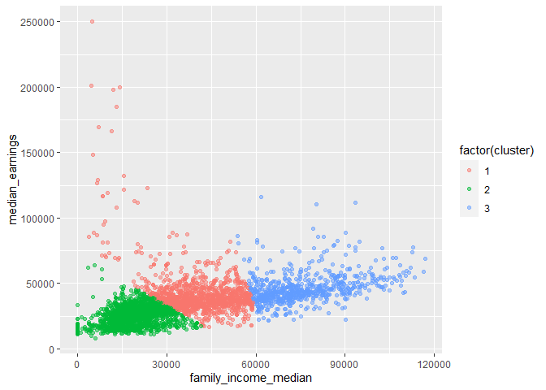

Clustering
================

-   [Load and explore data structure](#load-and-explore-data-structure)
-   [Variable Selection and Data
    Preparation](#variable-selection-and-data-preparation)
-   [Selecting collection of schools to target for
    grants](#selecting-collection-of-schools-to-target-for-grants)
-   [Conclusion](#conclusion)

Suppose a granting agency wants to identify colleges that have high
numbers of low-income and first generation colleges attendees to give
additional funding.

Using clustering methods, I will identify a collection of colleges that
meet these criteria.

``` r
# Load libraries
library(tidyverse)
library(ggdendro)
library(plotly)
```

# Load and explore data structure

``` r
setwd("C:/Users/danie/OneDrive/Desktop/Data")

colleges <- read.delim('colleges.tsv', 
                       header = TRUE, 
                       sep = '\t')
knitr::kable(head(colleges))
```

|     id | institution\_name                   | city       | state | locale        | control           | pred\_deg                                | highest\_degree | historically\_black | men\_only | women\_only | religious | sat\_verbal\_quartile\_1 | sat\_verbal\_quartile\_2 | sat\_verbal\_quartile\_3 | sat\_math\_quartile\_1 | sat\_math\_quartile\_2 | sat\_math\_quartile\_3 | sat\_writing\_quartile\_1 | sat\_writing\_quartile\_2 | sat\_writing\_quartile\_3 | agriculture\_major\_perc | resources\_major\_perc | architecture\_major\_perc | cultural\_major\_perc | communications\_major\_perc | comm\_tech\_major\_perc | computer\_science\_major\_perc | culinary\_major\_perc | education\_major\_perc | engineering\_major\_perc | eng\_tech\_major\_perc | language\_major\_perc | consumer\_science\_major\_perc | law\_major\_perc | english\_major\_perc | liberal\_arts\_major\_perc | library\_science\_major\_perc | bio\_science\_major\_perc | math\_stats\_major\_perc | military\_major\_perc | interdiscipline\_major\_perc | parks\_rec\_major\_perc | philo\_relig\_major\_perc | theology\_major\_perc | phys\_science\_major\_perc | science\_technician\_major\_perc | psych\_major\_perc | protective\_services\_major\_perc | public\_admin\_major\_perc | social\_science\_major\_perc | construction\_major\_perc | mechanics\_major\_perc | precision\_production\_major\_perc | transportation\_major\_perc | vis\_performing\_arts\_major\_perc | health\_medical\_major\_perc | business\_marketing\_major\_perc | history\_major\_perc | online\_only | part\_time\_percent | pell\_grant\_rate | retention\_rate | federal\_loan\_rate | median\_debt | median\_earnings | earnings\_more\_than\_25k |  cost | loan\_ever | pell\_ever | age\_entry\_avg | female\_share | married\_share | veteran\_share | first\_gen\_share | family\_income\_median | pct\_born\_us | poverty\_rate | unemployment\_rate | not\_working | top\_ten |
|-------:|:------------------------------------|:-----------|:------|:--------------|:------------------|:-----------------------------------------|:----------------|:--------------------|:----------|:------------|:----------|-------------------------:|-------------------------:|-------------------------:|-----------------------:|-----------------------:|-----------------------:|--------------------------:|--------------------------:|--------------------------:|-------------------------:|-----------------------:|--------------------------:|----------------------:|----------------------------:|------------------------:|-------------------------------:|----------------------:|-----------------------:|-------------------------:|-----------------------:|----------------------:|-------------------------------:|-----------------:|---------------------:|---------------------------:|------------------------------:|--------------------------:|-------------------------:|----------------------:|-----------------------------:|------------------------:|--------------------------:|----------------------:|---------------------------:|---------------------------------:|-------------------:|----------------------------------:|---------------------------:|-----------------------------:|--------------------------:|-----------------------:|-----------------------------------:|----------------------------:|-----------------------------------:|-----------------------------:|---------------------------------:|---------------------:|:-------------|--------------------:|------------------:|----------------:|--------------------:|-------------:|-----------------:|--------------------------:|------:|-----------:|-----------:|----------------:|--------------:|---------------:|---------------:|------------------:|-----------------------:|--------------:|--------------:|-------------------:|-------------:|:---------|
| 100654 | Alabama A & M University            | Normal     | AL    | City: Midsize | Public            | Predominantly bachelor’s-degree granting | Graduate degree | TRUE                | FALSE     | FALSE       | FALSE     |                      370 |                      410 |                      450 |                    350 |                    400 |                    450 |                        NA |                        NA |                        NA |                   0.0397 |                 0.0199 |                    0.0116 |                0.0000 |                      0.0000 |                  0.0348 |                         0.0348 |                     0 |                 0.1490 |                   0.1175 |                 0.0348 |                0.0000 |                         0.0281 |                0 |               0.0182 |                     0.0546 |                             0 |                    0.1026 |                   0.0199 |                     0 |                       0.0000 |                  0.0000 |                    0.0000 |                0.0000 |                     0.0248 |                                0 |             0.0579 |                            0.0050 |                     0.0364 |                       0.0480 |                         0 |                      0 |                                  0 |                           0 |                             0.0166 |                       0.0000 |                           0.1457 |               0.0000 | FALSE        |              0.0622 |            0.7115 |          0.6314 |              0.8204 |      33611.5 |            31400 |                 0.4622980 | 13415 |       0.93 |       0.81 |           20.63 |          0.53 |           0.03 |           0.01 |              0.39 |                29039.0 |         94.74 |         14.88 |               4.84 |          201 | FALSE    |
| 100663 | University of Alabama at Birmingham | Birmingham | AL    | City: Midsize | Public            | Predominantly bachelor’s-degree granting | Graduate degree | FALSE               | FALSE     | FALSE       | FALSE     |                      520 |                      580 |                      640 |                    520 |                    585 |                    650 |                        NA |                        NA |                        NA |                   0.0000 |                 0.0000 |                    0.0000 |                0.0018 |                      0.0456 |                  0.0000 |                         0.0099 |                     0 |                 0.0862 |                   0.0632 |                 0.0000 |                0.0090 |                         0.0000 |                0 |               0.0203 |                     0.0262 |                             0 |                    0.0619 |                   0.0135 |                     0 |                       0.0000 |                  0.0000 |                    0.0095 |                0.0000 |                     0.0181 |                                0 |             0.0840 |                            0.0280 |                     0.0244 |                       0.0501 |                         0 |                      0 |                                  0 |                           0 |                             0.0415 |                       0.2090 |                           0.1765 |               0.0212 | FALSE        |              0.2579 |            0.3505 |          0.8016 |              0.5397 |      23117.0 |            40300 |                 0.6604845 | 14805 |       0.92 |       0.59 |           22.67 |          0.65 |           0.11 |           0.03 |              0.38 |                34909.0 |         96.50 |         10.91 |               3.45 |          352 | FALSE    |
| 100690 | Amridge University                  | Montgomery | AL    | City: Midsize | Private nonprofit | Predominantly bachelor’s-degree granting | Graduate degree | FALSE               | FALSE     | FALSE       | TRUE      |                       NA |                       NA |                       NA |                     NA |                     NA |                     NA |                        NA |                        NA |                        NA |                   0.0000 |                 0.0000 |                    0.0000 |                0.0000 |                      0.0000 |                  0.0000 |                         0.0411 |                     0 |                 0.0000 |                   0.0000 |                 0.0000 |                0.0000 |                         0.0000 |                0 |               0.0000 |                     0.6301 |                             0 |                    0.0000 |                   0.0000 |                     0 |                       0.0000 |                  0.0000 |                    0.0000 |                0.2603 |                     0.0000 |                                0 |             0.0000 |                            0.0000 |                     0.0000 |                       0.0000 |                         0 |                      0 |                                  0 |                           0 |                             0.0000 |                       0.0000 |                           0.0685 |               0.0000 | FALSE        |              0.3727 |            0.6839 |          0.3750 |              0.7629 |           NA |            38100 |                 0.6466666 |  7455 |       0.97 |       0.70 |           32.82 |          0.51 |           0.62 |           0.19 |              0.51 |                30037.0 |         94.09 |         10.65 |               3.60 |           41 | FALSE    |
| 100706 | University of Alabama in Huntsville | Huntsville | AL    | City: Midsize | Public            | Predominantly bachelor’s-degree granting | Graduate degree | FALSE               | FALSE     | FALSE       | FALSE     |                      510 |                      575 |                      640 |                    510 |                    580 |                    650 |                        NA |                        NA |                        NA |                   0.0000 |                 0.0000 |                    0.0000 |                0.0000 |                      0.0318 |                  0.0000 |                         0.0273 |                     0 |                 0.0173 |                   0.2566 |                 0.0000 |                0.0173 |                         0.0000 |                0 |               0.0309 |                     0.0000 |                             0 |                    0.0855 |                   0.0218 |                     0 |                       0.0000 |                  0.0000 |                    0.0082 |                0.0000 |                     0.0209 |                                0 |             0.0218 |                            0.0000 |                     0.0000 |                       0.0173 |                         0 |                      0 |                                  0 |                           0 |                             0.0346 |                       0.1720 |                           0.2247 |               0.0118 | FALSE        |              0.2395 |            0.3281 |          0.8098 |              0.4728 |      24738.0 |            46600 |                 0.6605657 | 17520 |       0.92 |       0.60 |           23.19 |          0.55 |           0.17 |           0.04 |              0.34 |                39766.0 |         95.27 |          9.37 |               3.64 |          137 | FALSE    |
| 100724 | Alabama State University            | Montgomery | AL    | City: Midsize | Public            | Predominantly bachelor’s-degree granting | Graduate degree | TRUE                | FALSE     | FALSE       | FALSE     |                      380 |                      430 |                      480 |                    370 |                    425 |                    480 |                        NA |                        NA |                        NA |                   0.0000 |                 0.0000 |                    0.0000 |                0.0000 |                      0.0733 |                  0.0000 |                         0.0450 |                     0 |                 0.2150 |                   0.0000 |                 0.0000 |                0.0000 |                         0.0000 |                0 |               0.0183 |                     0.0000 |                             0 |                    0.1033 |                   0.0183 |                     0 |                       0.0000 |                  0.0183 |                    0.0000 |                0.0000 |                     0.0150 |                                0 |             0.0617 |                            0.1183 |                     0.0650 |                       0.0150 |                         0 |                      0 |                                  0 |                           0 |                             0.0567 |                       0.0633 |                           0.1067 |               0.0067 | FALSE        |              0.0902 |            0.8265 |          0.6219 |              0.8735 |      33452.0 |            27800 |                 0.3422256 | 11936 |       0.94 |       0.85 |           20.89 |          0.57 |           0.03 |           0.01 |              0.45 |                24029.5 |         94.53 |         16.96 |               4.81 |          251 | FALSE    |
| 100751 | The University of Alabama           | Tuscaloosa | AL    | City: Small   | Public            | Predominantly bachelor’s-degree granting | Graduate degree | FALSE               | FALSE     | FALSE       | FALSE     |                      490 |                      555 |                      620 |                    500 |                    570 |                    640 |                       480 |                       540 |                       600 |                   0.0000 |                 0.0054 |                    0.0000 |                0.0022 |                      0.1084 |                  0.0000 |                         0.0068 |                     0 |                 0.0840 |                   0.0640 |                 0.0000 |                0.0068 |                         0.0700 |                0 |               0.0178 |                     0.0000 |                             0 |                    0.0348 |                   0.0076 |                     0 |                       0.0302 |                  0.0000 |                    0.0060 |                0.0000 |                     0.0074 |                                0 |             0.0354 |                            0.0216 |                     0.0124 |                       0.0422 |                         0 |                      0 |                                  0 |                           0 |                             0.0360 |                       0.0946 |                           0.2870 |               0.0194 | FALSE        |              0.0852 |            0.2107 |          0.8700 |              0.4148 |      24000.0 |            42400 |                 0.6610854 | 20916 |       0.94 |       0.53 |           20.77 |          0.56 |           0.05 |           0.02 |              0.30 |                58976.0 |         96.08 |         10.05 |               3.26 |          292 | FALSE    |

# Variable Selection and Data Preparation

Before creating our clusters, I will remove missing values and duplicate
values from my data set. Some schools have more than one entry because
they have an undergraduate program, law school, etc., so distinct() will
select one row per college.

``` r
#cluster to identify schools to receive grant money
college_features <- colleges %>%
  select(institution_name, control, first_gen_share, poverty_rate, 
         family_income_median, median_earnings, top_ten) %>%
  na.omit() %>%
  distinct()


kmeans_cluster <- kmeans(select(college_features, -institution_name, -control), 3)
```

# Selecting collection of schools to target for grants

``` r
#plotting k-means clusters

#this is code for an interactive graph but can't upload as a github document because it uses html
# college_features <- college_features %>%
#   mutate(cluster = kmeans_cluster$cluster)
# 
# college_features %>%
#   plot_ly(x = ~family_income_median, 
#           y = ~median_earnings, 
#           color = ~factor(cluster),
#           hoverinfo = 'text',
#           text = ~paste('</br><b> Name: </b>', institution_name,
#                         '</br><b> Type: </b>', control))

college_features <- college_features %>%
  mutate(cluster = kmeans_cluster$cluster)

ggplot(college_features,
  aes(x = family_income_median,
     y = median_earnings,
     color = factor(cluster))) +
  geom_point(alpha = 0.50)
```

<!-- -->

The blue cluster represents schools with students that have low family
incomes, and may be our selection criteria to give grants. However, many
of these schools are private for-profit, which are known to be expensive
and provide poor quality education for low financial benefit - going
straight to the work force might be a better bet.

Since it might not be very ethical to sent students to these predatory
institutions and also perhaps not in the vision of the company giving
the grants, I will look at the qualities of the top 10 schools from the
US News and World Report and determine if there’s something about them
that makes them different. If so, are there any schools that are
similar?

One way to approach this is to view college major composition. Is there
a difference between the composition of student majors between the top
10 schools and the others?

``` r
top_ten <- 
  colleges %>%
  filter(top_ten == TRUE)

random_sample <-
  colleges %>%
  filter(top_ten == FALSE) %>%
  sample_n(40, replace = FALSE)

hier_data = rbind(top_ten, random_sample)

major_perc <-
  hier_data %>%
  select(institution_name, top_ten, ends_with('_major_perc')) %>%
  na.omit()

#compute the distance
euclidean <- dist(select(major_perc, -institution_name, -top_ten),
                  method = 'euclidean')

#hierarchical clustering
hier <- hclust(euclidean)

hier$labels <- major_perc$institution_name

#plot dendrogram
ggdendrogram(hier, rotate = TRUE, size = 2)
```

<!-- -->
Let’s color the top ten.

``` r
dendro_data <- dendro_data(hier)

dendro_data$labels <- unique(merge(dendro_data$labels,
                                   select(college_features, institution_name, top_ten),
                                   by.x = 'label',
                                   by.y = 'institution_name',
                                   all.x = TRUE))

ggplot(segment(dendro_data)) +
  geom_segment(aes(x = x, y = y, xend = xend, yend = yend)) +
  geom_text(data = label(dendro_data),
            aes(label = label, x= x, y = 0, hjust = 0, color = top_ten),
            size = 2) +
  coord_flip() +
  scale_y_reverse(expand = c(0.25, 0)) +
  theme_void() +
  theme(legend.position = 'bottom')
```

<!-- -->

# Conclusion

From the dendrogram above, as expected, the top 10 schools are all very
similar in terms of major composition. Schools that branch away right
away and thus probably not a wise investment include beauty schools and
community colleges. Some that we might consider include University of
Connecticut - Stanford and Fairleigh Dickinson University.
